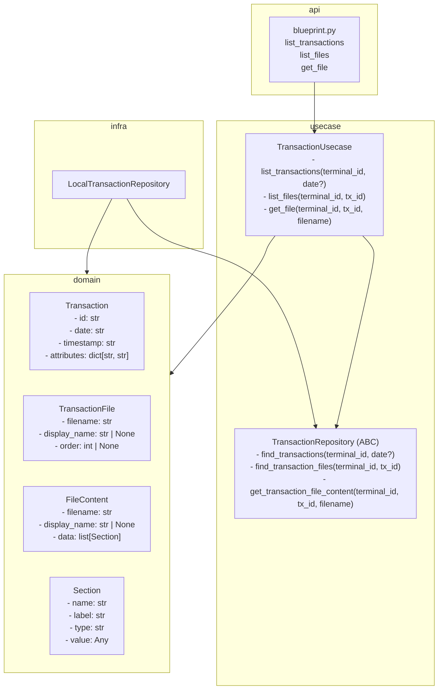

# Transaction 設計

## レイヤー構成

## 未解決の設計論点

### `terminal_id` とディレクトリ名の対応

`LocalTransactionRepository` は `root/<terminal_id>/` を走査する。
`terminal_id` に **IPアドレス** を使うか **ID**（`T001` 等）を使うかは保留。

| | IP アドレス | ID |
|---|---|---|
| メリット | 人間が見てどの端末かわかる | 安定・IP変更に強い |
| デメリット | IP変更で壊れる | ディレクトリ単体では端末の紐付け不明 |

収集フローの設計が決まるタイミングで合わせて決定する。

---

## ポート設計の意図

- `TransactionRepository` をABCとして切ることで、infraの差し替えを可能にする
- 取得元が「ローカルファイル」から「リモート」に変わっても usecase は触らない
- テスト時は `FakeTransactionRepository` に差し替えてファイルシステムなしでテストできる

