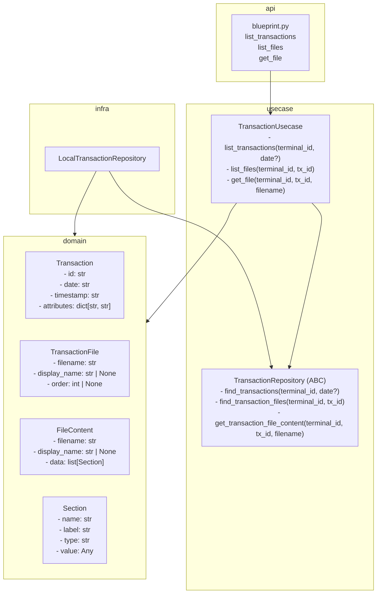

# Transaction 設計

## レイヤー構成

## ポート設計の意図

- `TransactionRepository` をABCとして切ることで、infraの差し替えを可能にする
- 取得元が「ローカルファイル」から「リモート」に変わっても usecase は触らない
- テスト時は `FakeTransactionRepository` に差し替えてファイルシステムなしでテストできる

